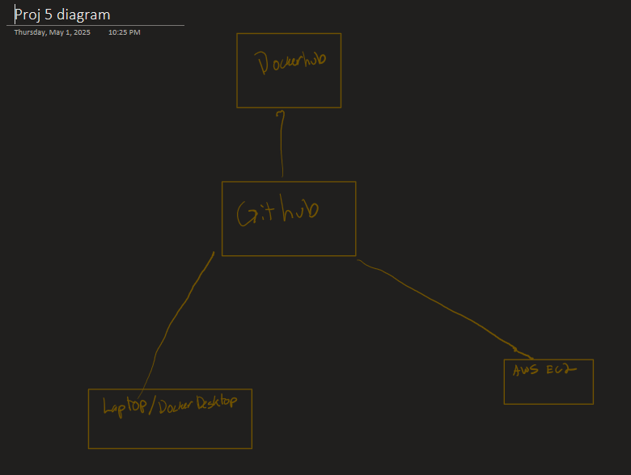

# Part 1
- to see the tags, `git tag`
- to tag `git tag [tagname]`
- to push `git push origin tag [tagname]`

- the workflow makes it to where if I update git tags then the dockerfile image version will update.  
- [workflow](https://github.com/WSU-kduncan/ceg3120-cicd-SnakeLitt/tree/main/.github/workflows) 
I tested it by committing files then looking at all the actions. 

# Part 2
- AMI info - ami-084568db4383264d4 (Ubuntu)
- Instance type - t2.medium
- Volume size - 30gb
-  Security group info - All access for inbound. Just made it easy on myself. 

- install `sudo apt install docker`
- login in `docker login username`
- docker pull `docker pull username/container`
- run container `docker run -d -p 8080:8080 --name my-angular-container angular-app-server` 
-  validate running `docker logs my-angular-container` 
- the [deploy]() file takes out the old images and puts in the new pulled one. 
- i could not figure out how to get my webhooks working. 

# Part 3 
- The goal of this project was to learn different ways to save to repositories and how to do what we learned in different ways. 
- tools that were used were, dockerhub, github, aws, ubuntu and wsl.
- I could not get webhooks to work. this was the code i kept on getting an error on `webhook -hooks ~/DockerProj4/deployment/hooks.json -verbose -port 9000` 
