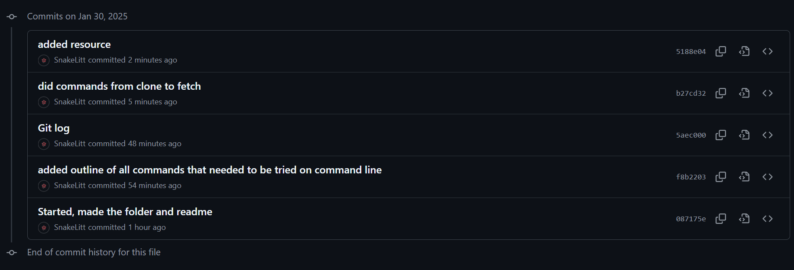
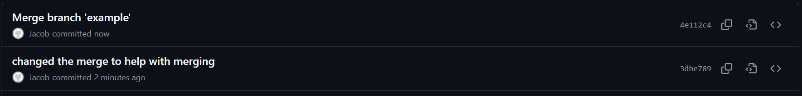
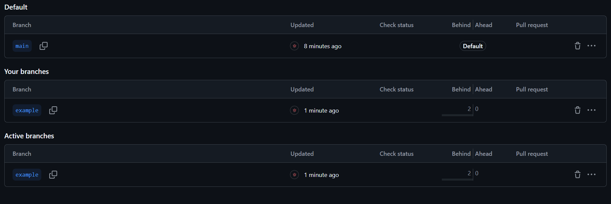

# Project 0 - Basics Guide

## Command line git

- status
  - Shows status of the local repository. This status includes:
    - number of local commits that have not been synced with remote (GitHub)
    - list of files in local folder than are NOT being tracked by git
    - list of files in local folder that have changes that need to be committed
  - `git status`
- log
  - Shows the past commits of what happened:

    - shows each comment

    - shows time of commit
  - `git log`
- clone
  - clones a git repository in a new directory
  - `git clone git@github.com:WSU-kduncan/ceg3120s25-SnakeLitt.git`
- add
  - updates the current working branch
    - ex: when adding a file to the git repository, need to git add the file before it shows in the git repository or being able to git pus or pull
  - `git add git@github.com:WSU-kduncan/ceg3120s25-SnakeLitt.git`
- rm
  - removes the file from the directory or removes a directory
  - `rm newfile.txt`
  - removed from the git repository and tracks it from being removed
  - `git rm newfile.txt`
- commit
  - it saves the current changes from current repository
  - also add a comment to the changes
    
  - `git commit` 
- push
  - updates current working repository to the remote repository
  - `git push`
- fetch
  - downloads objects and refs from another repository
  - similar to git pull but doesn't copy
  - `git fetch`
- merge
  - merges any branch that is needed to make significate changes
  
  - `git merge example`
- pull
  - fetch and copy from remote repository
  - `git pull`
- branch
  - shows the other branches in the repo
  
  - `git branch`
- tag
  - makes tags for the repository
  - `git tag example`
- checkout
  - changes to different branches of the repository
  - `git checkout example`
- init
  - create an empty repository 
  - `git init cookie.git`
- remote
  - manage set of repositories where you track
  - `git remote`

## git files & folders

Provide descriptions of expected contents and what these are used for

- .git folder
  - is the "folder" for all your git repositories and how you have something like github
  - ex: the `cookie.git` did in class
- .gitignore file
  - file where you do not track what is going on

- ~~.git/hooks~~

## GitHub

Provide basic how-to-use guides.  This should be short and sweet so that you can refer to it as a quick guide.

- Pull Requests
  - branch requested to change make the request on github
  - **DEMONSTRATE** Generate and complete a Pull Request in your repository in GitHub.  Pretend you are two people.
- ~~Actions~~
- ~~Releases~~

## SSH

Provide basic how-to-use guides.  This should be short and sweet so that you can refer to it as a quick guide.

- SSH authentication to repositories
  - `git clone git@github.com:WSU-kduncan/ceg3120s25-SnakeLitt.git` then you `cd ceg3120s25-SnakeLitt`
- SSH authentication to an AWS instance
  - `ssh -i ~/keys/ceg3120.pem ubuntu@snakehole.io` changed it to snakehole.io in hosts folder.
- Using the `config` file in the `.ssh` folder
  - used the config to change `ssh -i ~/keys/ceg3120.pem ubuntu@snakehole.io` to `ssh ceg3120`

## Resources
I used the command man for majority of my findings of all the different commands. If I needed more explaining I looked at these websites. 

- [Pro Git Book](https://git-scm.com/book/en/v2)

- [Git Fetch and Pull](https://www.theserverside.com/blog/Coffee-Talk-Java-News-Stories-and-Opinions/Git-pull-vs-fetch-Whats-the-difference#:~:text=Difference%20between%20Git%20fetch%20and,git%20pull%20command%20does%20both.)

- [Git merge](https://www.w3schools.com/git/git_branch_merge.asp?remote=github)

- [Git tag](https://stackoverflow.com/questions/18216991/create-a-tag-in-a-github-repository)

- [.git folder](https://stackoverflow.com/questions/29217859/what-is-the-git-folder)

